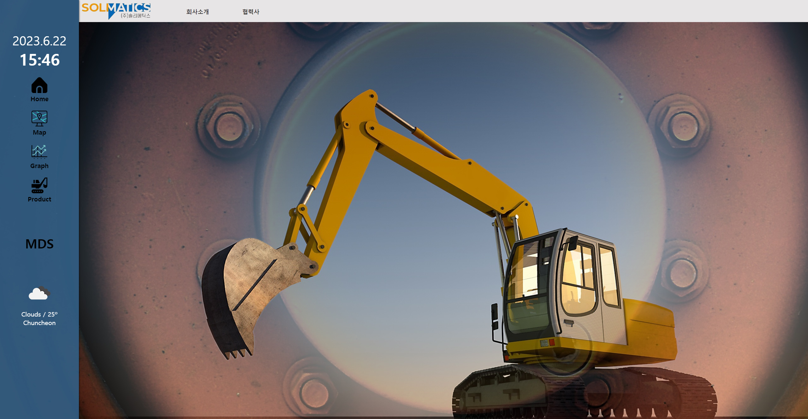
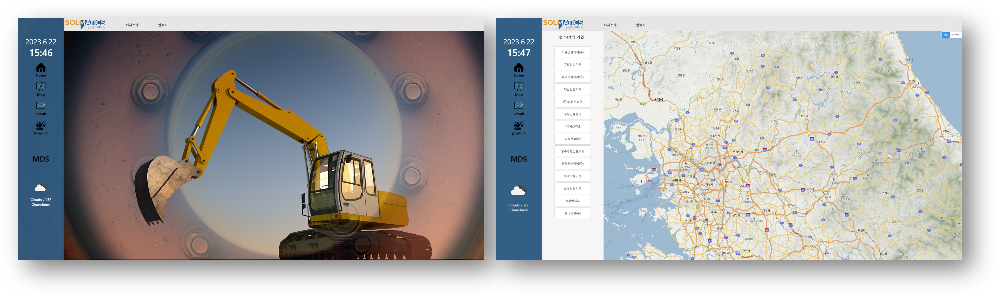
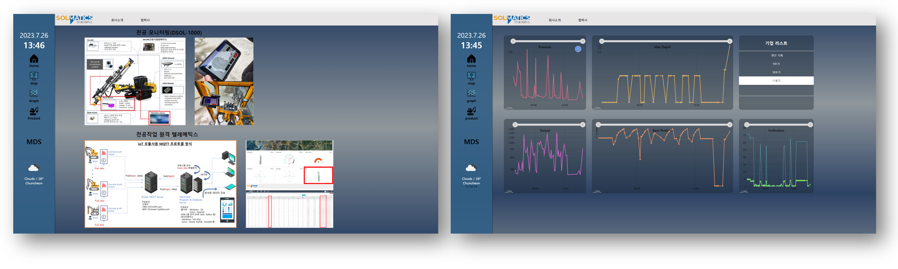
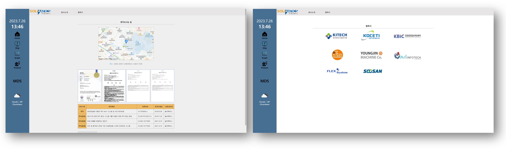

# 실시간 천공기 Dashboard 
## 📗목차 

- 📝 [개요](#-포트폴리오-개요)

- 🔗 [링크](#-링크)

- 💡 [프로젝트 기획](#-프로젝트-기획)

- 🔨 [사용 기술 스택](#-사용-기술-스택)

## 📝 포트폴리오 개요

>**프로젝트명**: 천공기 Smart Dashboard 
>
>**개발 기간**: 2022. 11 ~ 2023. 8 (현재 계속 유지보수 중) 
>
>**웹 배포 시작일**: 2022. 12. 1.
>
>**적응형 웹**: 데스크탑, 노트북, 태블릿, 모바일
>
>**상세 기능**: 오늘 작업을 시작한 시점에서부터 실시간으로 들어오는 데이터 값을 읽어 Line Graph로 보여줍니다.

## 🔗 링크
https://solimatics.co.kr

## 💡 프로젝트 기획

## 🔨 사용 기술 스택

## PC 버전

