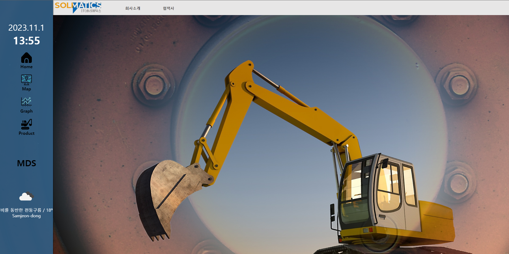
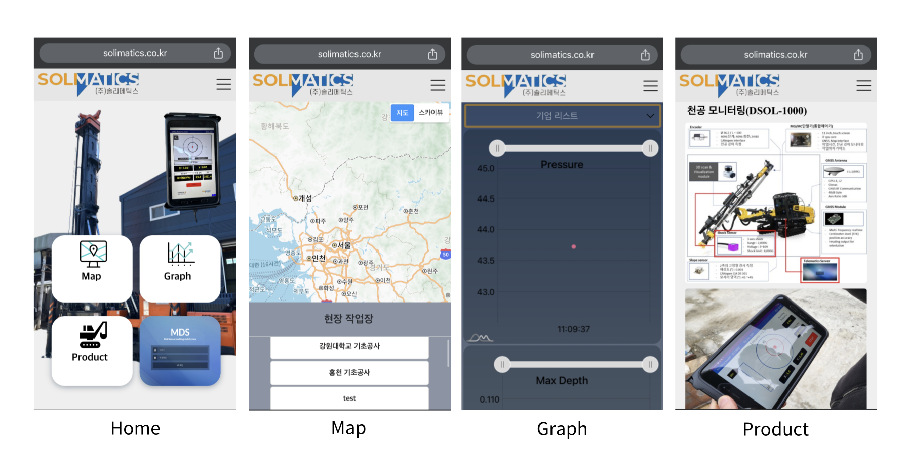
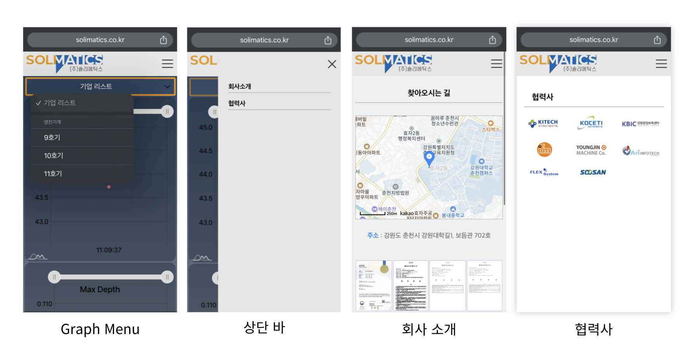

# 천공기 실시간 Dashboard 
천공기의 실시간 데이터를 보여주는 대시보드

## 📗목차 

- 📝 [개요](#-포트폴리오-개요)

- 🔗 [링크](#-링크)

- 💡 [프로젝트 기획 의도](#-프로젝트-기획-의도)

- 🛠 [사용 기술 스택](#-사용-기술-스택)
  
- 💻 [PC 버전(Desktop)](#-pc-버전desktop)
  
- 📱 [Mobile 버전](#-mobile-버전)

- 🎬 [시연 영상](#-시연-영상)

 

## 📝 포트폴리오 개요

>**프로젝트**: 천공기 실시간 그래프 Dashboard
>
>**개발 기간**: 2022. 11 ~ 2023. 8 (현재 계속 유지보수 중) 
>
>**배포**: CAFE 24 호스팅
>
>**웹 배포 시작일**: 2022. 12. 1.
>
>**적응형 웹**: 데스크탑, 노트북, 태블릿, 모바일
>
>**상세 기능**
>- **`Map 페이지`**: Kakao 지도 API를 사용하여 현재 작업하고 있는 <b>위치</b>를 보이도록 합니다. 
>- **`Graph 페이지`**: Amchart 라이브러리를 사용하여 데이터를 시각화하였습니다. 오늘 작업을 시작한 시점에서부터 실시간으로 들어오는 데이터 값을 읽어 <b>Line Graph</b>로 보여줍니다.
>- **`Product 페이지`**: 제품을 소개합니다.
>- **`MDS`**: Maintenance & Diagnosis System 관리자 웹 사이트로 이동 시켜줍니다.

  

## 🔗 링크
~~https://solimatics.co.kr~~ SSL 인증서 만료
  

## 💡 프로젝트 기획 의도
건축 장비 관련 SW 회사에서 교외 근로를 하면서 맡은 프로젝트입니다. 
천공기가 작동하면서 측정되는 실시간 데이터 값들을 그래프로 나타냅니다. 
각 Pressue, Torque, Max Depth 등의 그래프를 통해 <b>추세선</b>을 시각적으로 확인해보기 위함입니다.

  

## 🛠 사용 기술 스택

  

## 💻 PC 버전(Desktop)

 

## 📱 Mobile 버전

 

## 🎬 시연 영상

### 노트북 버전 Graph

https://github.com/sangmee123/Dashboard-main/assets/69633033/09b7af94-a148-4ed6-a7fb-7a89db68d5a6

### 노트북 버전 Map

https://github.com/sangmee123/Dashboard-main/assets/69633033/c4369c59-5018-4256-9bad-db169b80f101

